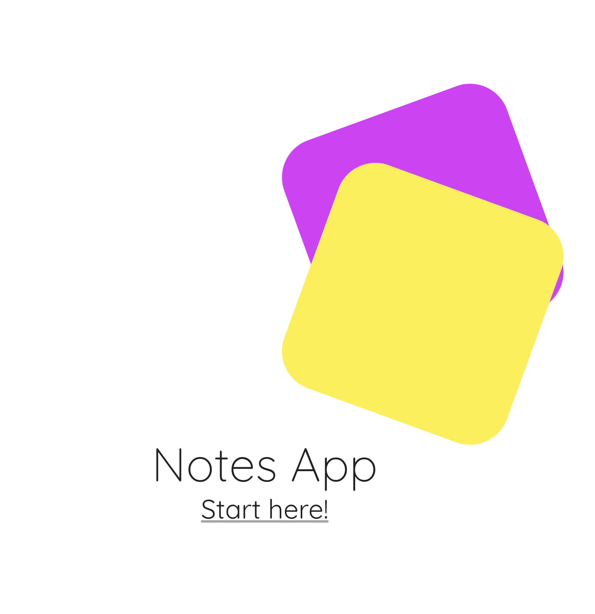
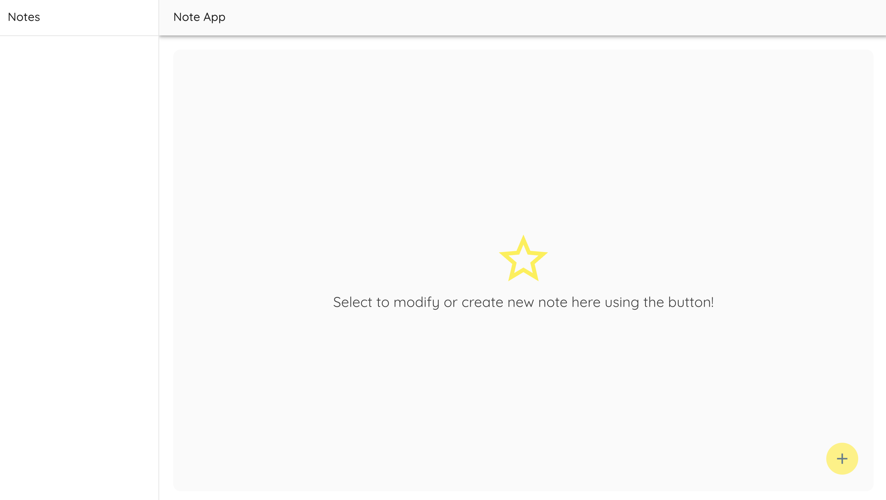
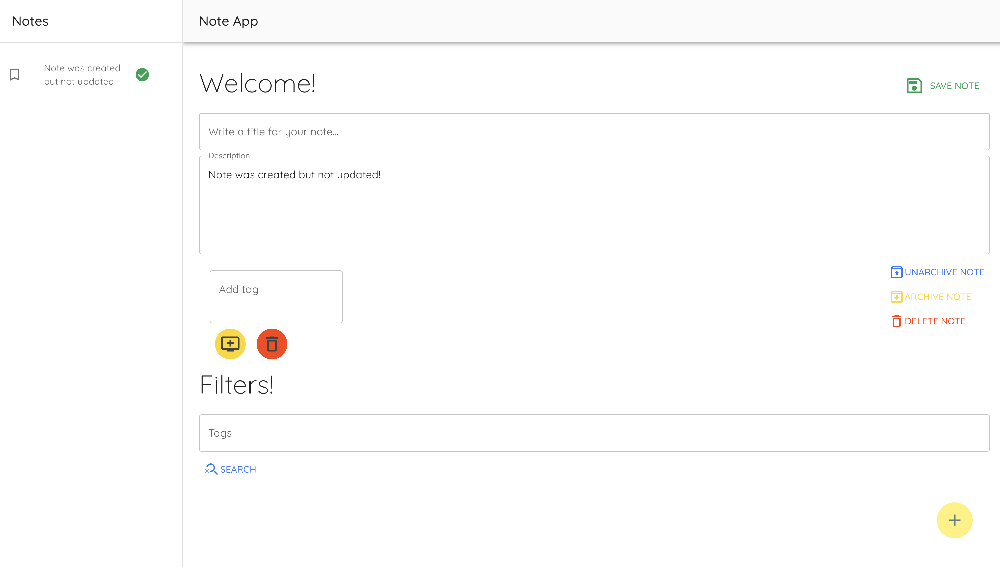
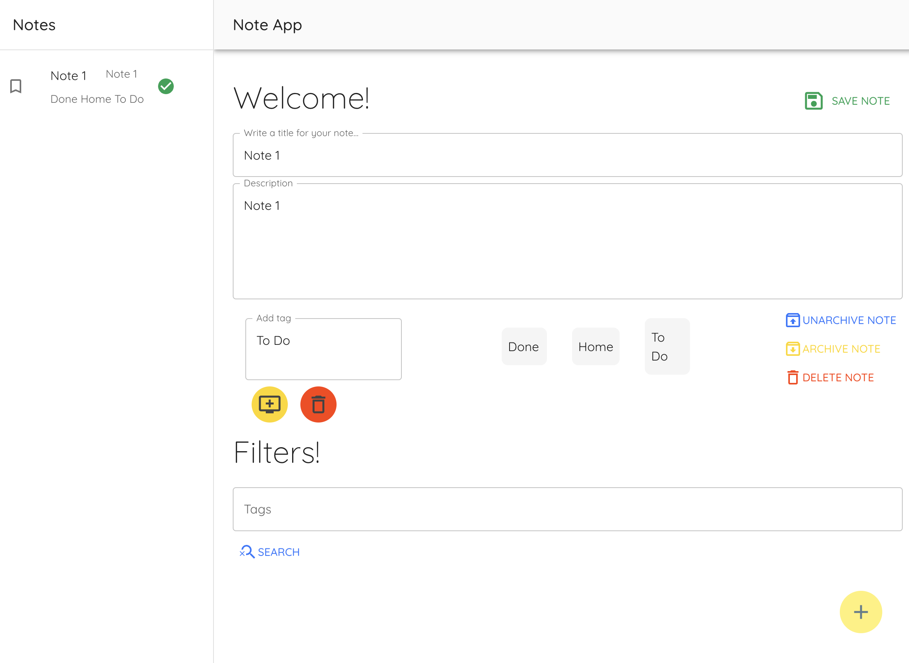
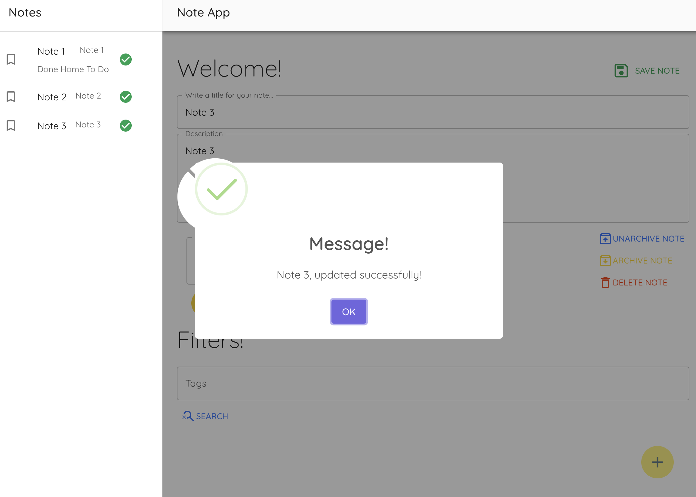
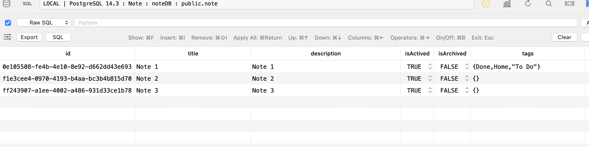
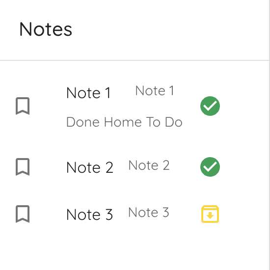
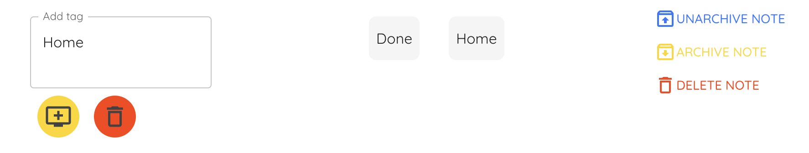
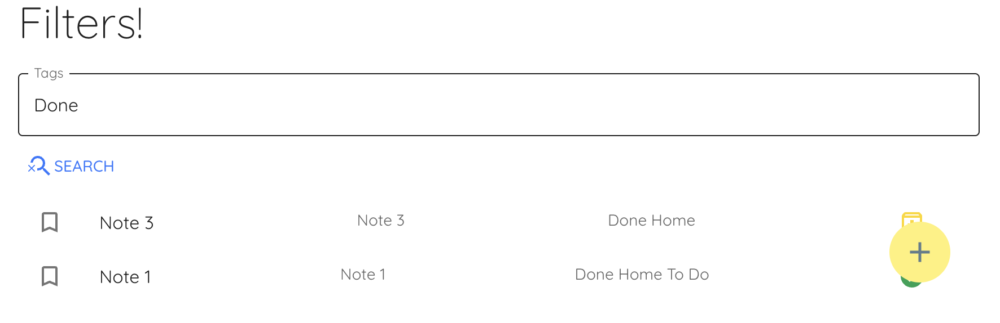

# Note App


---
Hello guys!

I'm going to write about ```backend``` and ```frontend``` folders.

## Backend - NestJS.
This project was created using **NestJS** - version: ```10.3.2``` and **NodeJS** - version: ```ˆ20.3.1```.
NestJS was selected due to this frameworks offers the **Service Layer Pattern**, I also used some importants features such as: 
- **TypeORM - Postgresql**:  Here I created some relations between ```User``` and ```Notes```. This relation was implemented in the backend, there are and ```User``` module for that.
- **class-validator, class-tranformer**

#### Steps to run the backend: 
These are basics steps, firts of all, you need to have installed the tools that I wrote before: **Nestjs, Nodejs,** and **Docker**, the steps to run this projects in your laptop are the following: 

- Go to the root's project and run the command: ```npm i```
- Clone the file ```.env.template``` and rename it as ```.env```
- Setting up the databse using ```docker-compose up -D```. I use *postgresql* for this exercise.
- Finally, run the command ```npm run start:dev```
---
## Frontend - NestJS.
In this opportunity, I selected ```React``` as framework to make a *Single Page Application*, I used some features in this project:

- **Axios**
- **Framer-Motion**
- **SweetAlert**
- **Material-UI**

#### Steps to run the fronted: 
These are the steps that you need to do to run this project: 
- Go to the root's project and run the command ```npm install```
- Clone the file ```.env.template``` and rename it as ```.env```
- Run the command ```npm run dev```


When you completed these steps, you are going to have running the backend and the frontend, it's important to run docker as well, because I used a ***postgres docker image***

## Let's talk about the app
This app is using the following endpoints:

- ```Post```
    - Create a new note : ```http://localhost:3000/notes/```
- ```Get```
    - Get notes: ```http://localhost:3000/notes/```
    - Get note by Id: ```http://localhost:3000/notes/{id}```
- ```Patch```
    - Update note by Id: ```http://localhost:3000/notes/{id}```
- ```Delete```
    - Delete note by Id: ```http://localhost:3000/notes/{id}```

### How does it work?
In this case, the magic for this app is ```Redux``` and of course, the backend.
I used the events to request the differents endpoints, using redux I stored each result.

Once you have these two projects running, you can see the home screen:


For this, I'm using ```React-Router```, the project has two routes:
- ```http://localhost:5173/``` - Home
- ```http://localhost:5173/notes``` - Notes Screen

### How does notes app work?
These are some functions of Notes Screen:



- Use the yellow button to create a new note, this is the starting point of our app.



##### These are some features that you can do in ```Note Screen```

- You will be able to create a new note.
- You will be able to delete the selected note.
- You will be able to update the selected note.
- You will be able to archive the selected note.
- You will be able to unarchive the archived note.

*Important*: If you want to save the content of each note, you need to use the button ```save note```.

##### If you create a new note, you will be able to:
- Create tags for the selected note.
- Delete tags for the selected note.
- Filter notes with a specific tag.

This is an example of a New Active note with its tags.



You can create as many notes you want. When you save a note, there is a pop up, this pop up was made using ```SweetAlert```,



All this data is being stored in postgres.



If you archive a note, the green icon is going to change to the yellow icon.

- All notes with green icon are actived notes
- All notes with yellow icon are archived notes.
- If your note has tags, they are going to be showed.



You can create and delete tags, if you want delete a tag, just select it and then use the red icon. You can delete, archive or unarchive notes as well.



Finally, you can filter the notes by tag. This filter returns every note that has the specific tag.



